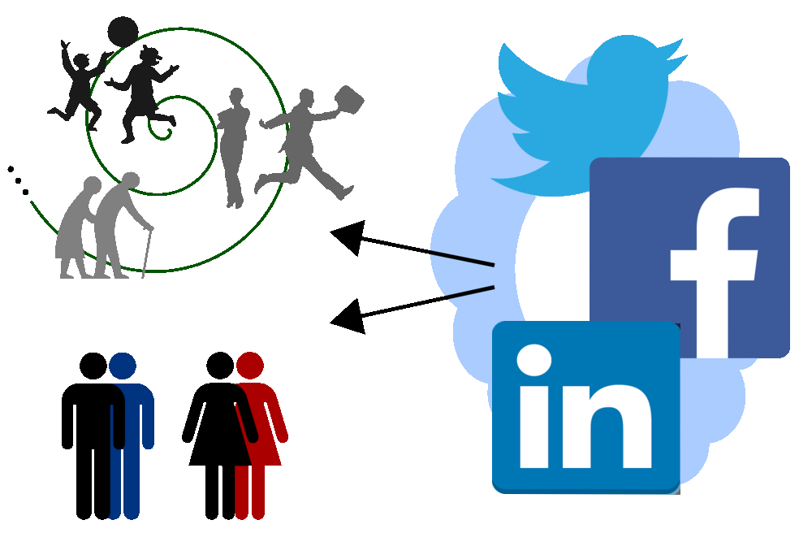

# Gender and Age Classification using Facial Features

# *Note: More images your provide, more accurate it can achieve.

Automatic age and gender classification has become relevant to an increasing amount of applications, particularly since the rise of social platforms and social media. Nevertheless, performance of existing methods on real-world images is still significantly lacking, especially when compared to the tremendous leaps in performance recently reported for the related task of face recognition. In this project we show that by learning representations through the use of deep-convolutional neural networks (CNN), a significant increase in performance can be obtained on these tasks compare to other models. Age and gender classification is an inherently challenging problem though, more so than many other tasks in computer vision. The main reason for this discrepancy in difficulty lies in the nature of the data that is needed to train these types of systems. While general object classification tasks can often have access to hundreds of thousands, or even millions, of images for training, datasets with age and/or gender labels are considerably smaller in size, typically numbering in the thousands or, at best, tens of thousands. The reason for this is that in order to have labels for such images we need access to the personal information of the subjects in the images. Namely we would need their date of birth and gender, and particularly the date of birth is a rarely released piece of information.

See instructions here: [Instructions.md](Instructions.md)

## Problem

Classifying age and gender from facial features using Convolution Neural Networks. 

## Research questions

Here are the core questions / subproblems you will address:

1. ...
2. ...
3. ...

## Related work

1. [Age and Gender Estimation of Unfiltered Faces](https://pdfs.semanticscholar.org/1be4/98d4bbc30c3bfd0029114c784bc2114d67c0.pdf)
2. [Age and Gender Classification using Convolutional Neural Networks](http://www.openu.ac.il/home/hassner/projects/cnn_agegender/CNN_AgeGenderEstimation.pdf)

## Data

Here is a description of the data you collected.

Here is an example data record.

## Methods

Here is an outline of your approach.

## Results

Here is a summary of the main results.

## Conclusions / Future Work

Here's the main conclusions and a list of directions for improvement.

